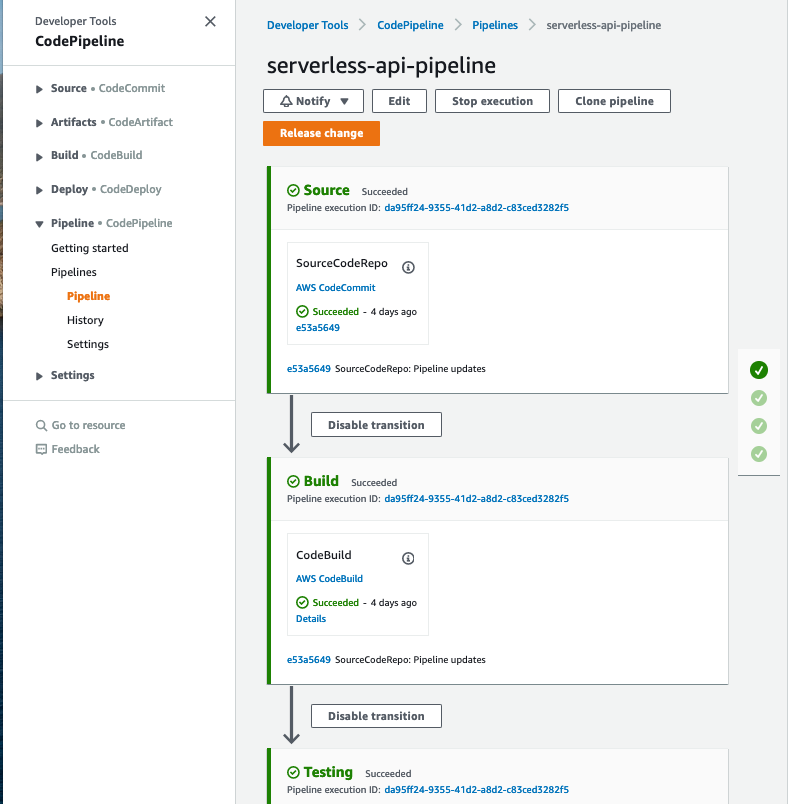
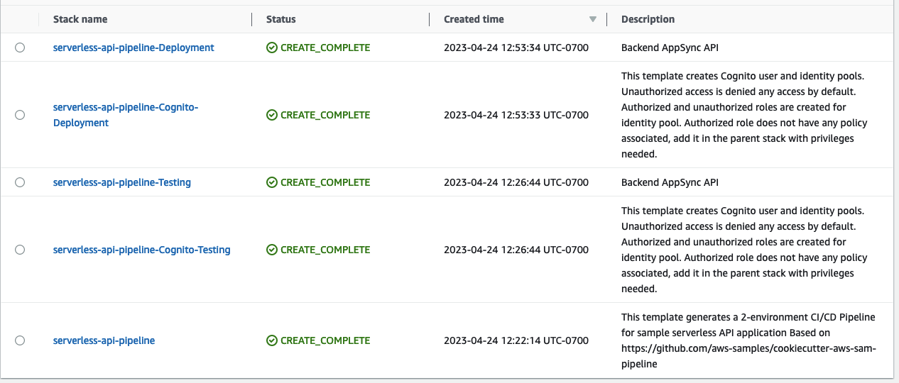
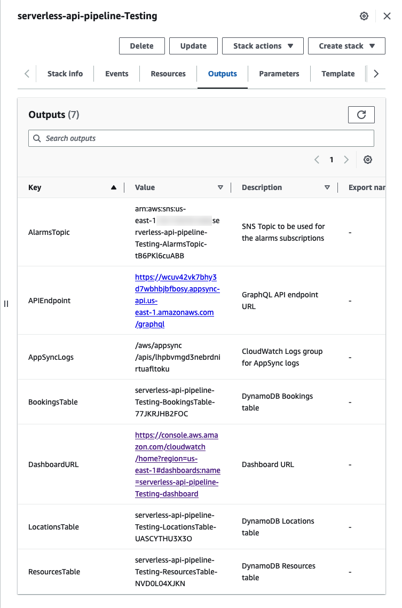
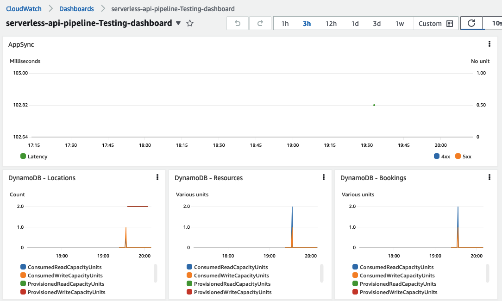

# javascript-appsync-sam-vtl
In this project, you will build a GraphQL API using Node.js, AWS AppSync with Apache Velocity Template Language (VTL) resolvers, and AWS Serverless Application Model (AWS SAM). We chose to use AWS SAM for future extensibility and to simplify the development of serverless resources, such as Lambda Resolvers and Lambda Authorizers.

## Project structure
This project contains source code and supporting files for a serverless application that you can deploy with the AWS Serverless Application Model (AWS SAM) command-line interface (CLI). It includes the following files and folders:

- `template.yaml` - A template that defines the application's AWS resources.
- `pipeline.yaml` - A template that defines the application's CI/CD pipeline.
- `buildspec.yml` - A template that defines the application's build process.
- `src\mapping_templates`- AWS AppSync [unit resolver mapping templates](https://docs.aws.amazon.com/appsync/latest/devguide/resolver-mapping-template-reference-overview.html)
- `__tests__/integration` - Integration tests for the API. 
- `__tests__/unit` - Unit tests for the API. 
- `__tests__/testspec.yml` - A template that defines the API's test process.

The application uses a shared Amazon Cognito stack for authentication/authorization. The shared stack will be deployed automatically if you use the CI/CD pipeline included in this project. If you deploy the application manually, you will need to create this stack and update the `template.yaml` parameters section with the stack name. See the manual deployment section for more details.

## Deploy the CI/CD pipeline
To create the CI/CD pipeline, we will copy the code from the serverless-samples directory into a new and separate directory and use this new directory as the codebase for your pipeline. 

First, navigate to the root directory of this repository. To verify your location, run the command *basename "$PWD"* - your terminal should return `serverless-samples` as an output. Now run the following commands:

```console
serverless-samples:~$ git subtree split -P serverless-graphql-api -b serverless-graphql-api
serverless-samples:~$ mkdir ../serverless-graphql-api-cicd && cd ../serverless-graphql-api-cicd
serverless-graphql-api-cicd:~$ git init -b main
serverless-graphql-api-cicd:~$ git pull ../serverless-samples serverless-graphql-api
serverless-graphql-api-cicd:~$ cd javascript-appsync-sam-vtl
```

To create the pipeline, run the following command:

```console
javascript-appsync-sam-vtl:~$ aws cloudformation create-stack --stack-name serverless-api-pipeline --template-body file://pipeline.yaml --capabilities CAPABILITY_IAM
```
The pipeline will attempt to run and will fail at the SourceCodeRepo stage as there is no code in the AWS CodeCommit yet.

***NOTE:** If you change stack name, avoid stack names longer than 25 characters. In case you need longer stack names, check comments in the pipeline.yaml and update accordingly.*

***Note:** You may need to set up AWS CodeCommit repository access for HTTPS users [using Git credentials](https://docs.aws.amazon.com/codecommit/latest/userguide/setting-up-gc.html?icmpid=docs_acc_console_connect_np) and [set up the AWS CLI Credential Helper](https://docs.aws.amazon.com/console/codecommit/connect-tc-alert-np).*

Once you have access to the code repository, navigate to the javascript-appsync-sam-vtl folder, and if you changed stack name, make sure that Parameters section of template.yaml is updated with the output values from the shared Amazon Cognito stack, and push the code base to CodeCommit to start an automated deployment:

```console
javascript-appsync-sam-vtl:~$ git remote add origin <URL to AWS CodeCommit repository>
javascript-appsync-sam-vtl:~$ git push origin main
```

Navigate to the AWS CodePipeline in the AWS Management Console and release this change if needed by clicking "Release change" button.



Congratulations! 

You have created a CI/CD pipeline with code repository and two environments - testing and production deployment. Each of the environments has all the resources, including their own shared Cognito stacks. The build stage automatically performs all the unit tests. Testing environment runs integration tests before stopping for a manual production deployment approval step. This is a typical behavior of the Continuous Delivery pipelines - a final human approval step is part of the deployment workflow. 

For a Continuous Deployment pipeline, you would remove the manual approval step. This way, each change in the code repository would be deployed to the production environment immediately after passing integration testing steps in the testing environment.

You can inspect the CloudFormation stacks deployed as part of the CI/CD environment in the [AWS Management Console](https://console.aws.amazon.com/cloudformation/home):



Check out testing and deployment stack outputs in the console:



Click on the CloudWatch dashboard link in the stack outputs to see the metrics emitted during the integration testing:



To use APIs in the testing and production deployment environments, you can use an HTTP (or GraphQL) client and the API endpoint URL provided in the CloudFormation stack outputs. Keep in mind that you will need to create user and authenticate using Cognito to get the access token that API uses for authentication/authorization. See the [Cognito deployment instructions](../shared/README.md) for more details on how to do it. You would use the access token as an Authorization header value while sending HTTP request to the API endpoint. 
For an example on how to create a GraphQL client, also see this [documentation article](https://docs.aws.amazon.com/appsync/latest/devguide/building-a-client-app.html).

---

## Alternative to the CI/CD - a manual deployment

***Note: This step is an alternative to the CI/CD pipeline deployment. Skip to the cleanup instructions if you deployed the pipeline already.***

As an alternative to the automated deployment using CI/CD pipeline, you may choose to deploy shared resources and application manually. Typically, you would use this approach for a quick "proof of concept" deployment, or in your individual development environment, when you want to run unit and integration tests before pushing your changes to the code repository.

To deploy the application manually, follow the instructions below.

### 1. Amazon Cognito setup
This example uses a shared stack that deploys Amazon Cognito resources. See [README.md](../shared/README.md) in the shared resources directory for the stack manual deployment instructions. After manual deployment finished, update your SAM template file `template.yaml` parameter CognitoStackName with the shared Amazon Cognito stack name. 

After the stack is created manually, create a user account for authentication/authorization. Deployment by the CI/CD pipeline will perform the following steps for you automatically. 

- Navigate to the URL specified in the shared stack template outputs as CognitoLoginURL and click link "Sign Up". After filling in the new user registration form, you should receive an email with a verification code. Use it to confirm your account. 

- After this first step, your new user account will be able to access public data and create new bookings. To add locations and resources you will need to navigate to the AWS Console, pick the Amazon Cognito service, select the User Pool instance that was created during this deployment, navigate to "Users and Groups", and add your user to the administrative users group. 

- As an alternative to the AWS Console you can use AWS CLI to create and confirm user signup:
```console
javascript-appsync-sam-vtl:~$ aws cognito-idp sign-up --client-id <cognito user pool application client id> --username <username> --password <password> --user-attributes Name="name",Value="<username>"
javascript-appsync-sam-vtl:~$ aws cognito-idp admin-confirm-sign-up --user-pool-id <cognito user pool id> --username <username> 
```

While using command line or third-party tools such as Postman to test APIs, you will need to provide an Access Token in the request "Authorization" header. You can authenticate with Amazon Cognito User Pool using AWS CLI (this command is also available in AWS SAM template outputs) and use the IdToken value present in the output of the command:

```console
javascript-appsync-sam-vtl:~$ aws cognito-idp initiate-auth --auth-flow USER_PASSWORD_AUTH --client-id <cognito user pool application client id> --auth-parameters USERNAME=<username>,PASSWORD=<password>
```

### 2. Application deployment
To build and deploy your application for the first time, run the following in your shell:

```console
javascript-appsync-sam-vtl:~$ npm install
javascript-appsync-sam-vtl:~$ sam build
javascript-appsync-sam-vtl:~$ sam deploy --guided --stack-name javascript-appsync-sam-vtl
```

The first command will build the source of your application. The second command will package and deploy your application to AWS, with a series of prompts:

* **Stack Name**: The name of the stack to deploy to CloudFormation. This should be unique to your account and region, and a good starting point would be something matching your project name.
* **AWS Region**: The AWS region you want to deploy your app to.
* **Parameter CognitoStackName**: The shared Amazon Cognito stack name.
* **Confirm changes before deploy**: If set to yes, any change sets will be shown to you before execution for manual review. If set to no, the AWS SAM CLI will automatically deploy application changes.
* **Allow SAM CLI IAM role creation**: Many AWS SAM templates, including this example, create AWS IAM roles required for the AWS Lambda function(s) included to access AWS services. By default, these are scoped down to minimum required permissions. To deploy an AWS CloudFormation stack which creates or modifies IAM roles, the `CAPABILITY_IAM` value for `capabilities` must be provided. If permission isn't provided through this prompt, to deploy this example, you must explicitly pass `--capabilities CAPABILITY_IAM` to the `sam deploy` command.
* **Save arguments to samconfig.toml**: If set to yes, your choices will be saved to a configuration file inside the project, so that in the future you can just re-run `sam deploy` without parameters to deploy changes to your application.

The AppSync endpoint API will be displayed in the outputs when the deployment is complete.

### 3. Testing
Unit tests are defined in the `__tests__\unit` folder in this project. Integration tests are defined in the `__tests__\integration` folder.

Unit tests use the AWS SDK to evaluate AWS AppSync resolver code. They use mock data, not the integrations with the backend services. Use the following command to run unit tests:
```console
javascript-appsync-sam-vtl:~$ npm run test:unit
```

Integration tests send GraphQL queries to the AWS AppSync endpoint and verify response received. In addition, integration tests use a WebSocket connection to the AWS AppSync for GraphQL subscriptions. Run the test initialization script first to create the necessary accounts in Amazon Cognito and to retrieve access tokens. Cleanup your resources after the integration tests are complete:

```console
javascript-appsync-sam-vtl:~$ eval "$(./__tests__/integration/test_init.sh)" 
javascript-appsync-sam-vtl:~$ npm run test:integration
javascript-appsync-sam-vtl:~$ eval "$(./__tests__/integration/test_cleanup.sh)" 
```

---

## Cleanup

To delete the sample application that you created, use the AWS CLI:

```console
javascript-appsync-sam-vtl:~$ sam delete --stack-name javascript-appsync-sam-vtl
```

_Note: If you created shared Cognito stack manually, follow shared stack cleanup instructions in the [README.md](../shared/README.md) in shared resources directory._

If you created CI/CD pipeline, you will need to delete it, including all testing and deployment stacks created by the pipeline. Please note that actual stack names may differ in your case, depending on the pipeline stack name you used.

CI/CD pipeline stack deletion may fail if build artifact Amazon S3 bucket is not empty. In such case get bucket name using following command and looking for BuildArtifactsBucket resource's PhysicalResourceId:

```console
javascript-appsync-sam-vtl:~$ aws cloudformation list-stack-resources --stack-name serverless-api-pipeline
```

Then open AWS Management Console, navigate to S3 bucket with build artifacts and empty it.

After that, delete all stacks created by the CI/CD pipeline and pipeline itself:

```console
javascript-appsync-sam-vtl:~$ aws cloudformation delete-stack --stack-name serverless-api-pipeline-Testing
javascript-appsync-sam-vtl:~$ aws cloudformation delete-stack --stack-name serverless-api-pipeline-Cognito-Testing
javascript-appsync-sam-vtl:~$ aws cloudformation delete-stack --stack-name serverless-api-pipeline-Deployment
javascript-appsync-sam-vtl:~$ aws cloudformation delete-stack --stack-name serverless-api-pipeline-Cognito-Deployment
javascript-appsync-sam-vtl:~$ aws cloudformation delete-stack --stack-name serverless-api-pipeline
```
